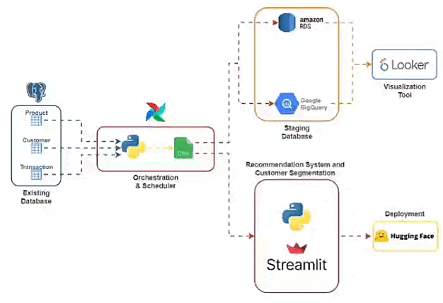

# SmartSelectPro

A recommendation system and customer segmentation program

System Recommendation Demo: [HuggingFace](https://huggingface.co/spaces/ardian407/customer_clustering_and_fashion_product_recommender)

Dashboard for EDA: [Looker](https://lookerstudio.google.com/reporting/4f505408-e4a4-4e5b-ba86-f9d6fdf2378a)

## High Level Process of the Project

## About the Recommendation System and Clustering Model

This overall recommendation system and customer segmentation program is built by using the [Fashion E-Commerce](https://www.kaggle.com/datasets/aldoattallah/fashion-ecommerce) dataset from kaggle. The dataset contains the information about the transactions, products, customers and click event. Since this project prioritize simplicity, we only use the transactions, products and customers data.

Furthermore, to calculate the similarity for the recommendation system, we used cosine similarity. As for the customer segmentatin program, we use the K-Means algorithm for the clustering which utilize the numeric features from the dataset.

The recommendation system is built using two approaches:
- Content-based filtering: recommendation based on the similarity of the product
- Collaborative filtering: recommendation based on the similarity of user behavior

Customer segmentation program:
- Using K-Means algorithm

## Data Pipeline

The main idea of the development of the data pipeline is to make sure that all people that are contributed to this project can see and access the dataset after being cleaned by Data Engineer. Thus, we tried to make sure that the process of the data fetching from an existing database that simulated the actual system that contain the original dataset, the process of data cleansing and uploading data to the cloud can be done automatically.

Therefore, we used Apache Airflow for the orchestration and scheduling purposes. As for the staging database that contain the cleaned data, we will use 2 databases; Google BigQuery and Amazon RDS.

Approach 1:
1. Data orchestration and scheduling using `Apache Airflow`
    - Fetch data from `PostgreSQL`
    - Data cleansing using `Python Script`
    - Insert clean data to `Amazon RDS`
2. Data visualization using `Looker`
    - Fetch data from `Amazon RDS`
    - Visualize clean data

Approach 2:
1. Data orchestration and scheduling using `Apache Airflow`
    - Fetch data from `PostgreSQL`
    - Data cleansing using `Python Script`
    - Insert clean data to `Google BigQuery`
2. Data visualization using `Looker`
    - Fetch data from `Google BigQuery`
    - Visualize clean data

## Repository Structure Explanation

Folder `Data_Pipeline`
- This folder contains the data pipeline used in this project
- The `airflow_lite.yaml` is the docker compose file that contains the services used in this project.
- The `dags/` folder is related to the DAG script used for Apache Airflow

Folder `Model_&_Deployment`
- This folder contains the main program for this project
- The notebook `clustering.ipynb` is related to the development of the customer segmentation program.
- The notebook `recommender-system.ipynb` is related to the development of the recommendation system.
- Under `deployment/` folder, there are files related to the deployment of the recommendation system and customer segmentation program using `Streamlit`.

## Additional Notes

- This system is trained on a very specific dataset that have been mentioned before. Therefore, any forms of change that required the needs of dataset changing will resulted to the tweaking process of the entire code structure.
- To run the data pipeline, please check that the pipeline needs several folder mounted to the Apache Airflow service. To check the required folders check the `Data_Pipeline/airflow_lite.yaml` file.

## People Involved in This Project

1. Ardianto as Data Scientist
    - [Github](https://github.com/ardi407)
    - [Linkedin](https://www.linkedin.com/in/ardianto407/)
2. Dwita Alya W. as Data Analyst
    - [Github](https://github.com/dwitawin)
    - [Linkedin](https://www.linkedin.com/in/dwita-alya/)
3. Fauzan Risqullah as Data Engineer
    - [Github](https://github.com/fauzanrisqullah)
    - [Linkedin](https://www.linkedin.com/in/fauzan-risqullah-0996bb127/)